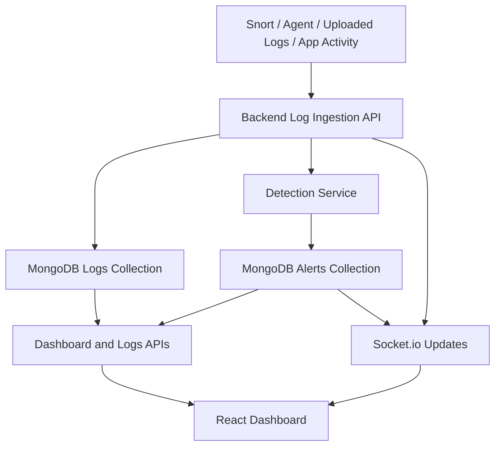

# ThreatLens Final Report Content

## Title
**ThreatLens: A Security Monitoring and Intrusion Detection Platform with Log Ingestion, Alert Correlation, and Dashboard Visualization**

## Abstract
ThreatLens is a full-stack security monitoring and intrusion detection platform developed to collect security-related events, analyze them for suspicious activity, generate alerts, and present the results through a dashboard. The system combines a React frontend, a Node.js/Express backend, MongoDB for storage, a Python-based IDS microservice for scan and anomaly support, and an agent layer for log forwarding and Snort integration. The platform supports authentication, email verification, role-based access control, event ingestion, alert generation, asset management, and dashboard-based monitoring. The project demonstrates how different security modules can be integrated into a unified monitoring workflow. While the architecture supports live updates and Snort-based ingestion, some parts remain prototype-oriented and can be extended further for fully production-grade deployment.

## Chapter 1: Introduction

### 1.1 Background
Modern organizations face continuous cybersecurity threats such as brute force attacks, denial-of-service activity, unauthorized access attempts, credential stuffing, and network reconnaissance. Monitoring these threats manually is difficult because of the large volume of logs generated by applications, servers, and security tools. This creates the need for a centralized system that can collect logs, analyze them, generate alerts, and provide a clear monitoring interface.

### 1.2 Problem Statement
Many small and medium environments do not have a unified platform for collecting logs, detecting suspicious behavior, and visualizing security events. Existing enterprise SIEM and IDS platforms are often costly and complex. The problem addressed in this project is the design and implementation of a prototype platform that can ingest logs, detect attacks using rule-based and anomaly-oriented logic, and present alerts through a web dashboard.

### 1.3 Objectives
The main objectives of the project are:
- To collect security-related logs and events from different sources.
- To store and organize logs and alerts in a structured database.
- To detect suspicious behavior using rule-based and correlation-based logic.
- To support Snort-based alert ingestion for security event monitoring.
- To provide a dashboard for viewing logs, alerts, and system activity.
- To implement user authentication, email verification, and role-based access control.
- To maintain an extensible architecture for future real-time and machine-learning enhancements.

### 1.4 Scope
The project focuses on security monitoring, log ingestion, alert generation, dashboard visualization, and prototype IDS support. It includes a working full-stack application with authentication, asset management, logs, alerts, dashboard analytics, and live update support through Socket.io. The project does not claim full enterprise-grade packet capture, complete SOC automation, or advanced production-ready ML deployment in its current version.

## Chapter 2: Literature Review and Background

### 2.1 Intrusion Detection Systems
An Intrusion Detection System (IDS) is used to monitor events and identify malicious or abnormal behavior. IDS solutions can be classified as host-based or network-based, and may rely on signature-based, anomaly-based, or hybrid detection strategies.

### 2.2 Signature-Based Detection
Signature-based detection compares incoming events against known attack patterns. This method is accurate for known threats and is commonly used in tools such as Snort.

### 2.3 Anomaly-Based Detection
Anomaly-based detection identifies unusual behavior by comparing activity against expected patterns. This approach is useful for detecting unknown or evolving threats, but it may produce more false positives if not carefully tuned.

### 2.4 Security Monitoring Dashboards
Security dashboards help analysts review logs, alerts, attack trends, and system health in a centralized interface. They improve visibility, reduce investigation time, and support decision making during incidents.

### 2.5 Motivation for the Proposed System
ThreatLens was developed to combine core ideas from IDS, SIEM-like monitoring, and dashboard visualization into one educational full-stack project. It provides a practical demonstration of secure authentication, log correlation, alerting, and frontend visualization in a single architecture.

## Chapter 3: Proposed System

### 3.1 Overview
ThreatLens is designed as a multi-component platform with separate layers for presentation, API handling, detection, storage, and log forwarding. The system accepts events from application activity, uploaded logs, and Snort-oriented ingestion, stores them in MongoDB, applies detection rules, and presents the results in a dashboard.

### 3.2 Main Components
- **Frontend:** Built with React for dashboard views, logs, alerts, assets, reports, and authentication pages.
- **Backend API:** Built with Node.js and Express for authentication, ingestion, dashboard analytics, alerts, logs, users, and assets.
- **Database:** MongoDB with Mongoose schemas for users, logs, alerts, assets, organizations, refresh tokens, API keys, and audit records.
- **IDS Engine:** A Python/Flask microservice that exposes health and scan endpoints and includes anomaly-detection support.
- **Agent Layer:** A Node-based agent that forwards logs and supports Snort file parsing for ingestion into the backend.

### 3.3 High-Level Workflow
1. Events are generated by sources such as Snort, request logs, uploaded files, or internal activity.
2. Events are sent to the backend ingestion pipeline.
3. Logs are stored in MongoDB.
4. Detection logic evaluates logs and creates alerts when attack patterns are found.
5. Dashboard APIs aggregate the stored data.
6. The frontend displays logs, alerts, and metrics.
7. Socket.io pushes live UI updates when new logs or alerts are created.

### 3.4 System Flowchart

## Chapter 4: System Architecture and Modules

### 4.1 Frontend Module
The frontend is implemented in React and provides the user interface of the system. It includes pages for login, registration, email verification, dashboard, alerts, logs, assets, reports, and other monitoring-oriented sections. Axios is used for API communication, and authentication state is managed using React context.

### 4.2 Backend API Module
The backend is implemented using Node.js and Express. It provides REST APIs for:
- authentication and email verification
- user session and token management
- logs and alert handling
- dashboard analytics
- asset management
- user and API key administration
- report and monitoring support

It also initializes Socket.io for live frontend refresh.

### 4.3 Database Module
MongoDB is used because logs and alerts contain flexible, semi-structured fields. Important collections include:
- Users
- Logs
- Alerts
- Assets
- Organizations
- Refresh Tokens
- API Keys
- Audit Logs

### 4.4 IDS Engine Module
The Python IDS microservice exposes endpoints such as `/health` and `/scan`. It is intended to support rule-based and anomaly-based detection workflows. In the current project, this module functions as a separate support service rather than the primary backend.

### 4.5 Agent and Snort Integration Module
The agent watches configured log inputs and forwards normalized events to the backend. Snort alert parsing is supported through dedicated parser logic. This makes it possible to ingest Snort alert lines and represent them inside the ThreatLens log and alert pipeline.

### 4.6 Authentication and Access Control Module
The project supports:
- user registration and login
- email verification
- JWT-based authentication
- refresh-token handling
- role-based access control
- organization-based data isolation

### 4.7 Dashboard and Monitoring Module
The dashboard shows counts, timelines, alert summaries, and traffic-oriented activity. Logs and alerts are available through dedicated pages, while dashboard aggregation logic summarizes the database content for charts and cards.

### 4.8 Assets Module
The assets module stores monitored systems such as servers, hosts, or services. It helps associate alerts with protected infrastructure and supports inventory-style management inside the project.

## Chapter 5: Implementation Details

### 5.1 Frontend Implementation
The frontend is developed with React. Major pages include:
- Login and Register pages
- Verify Email page
- Dashboard page
- Alerts page
- Logs page
- Assets page
- Reports and additional monitoring pages

The frontend communicates with the backend using Axios and receives live update support through Socket.io listeners.

### 5.2 Backend Implementation
The backend uses Express middleware for security and request handling, including JSON parsing, cookies, CORS, rate limiting, and secure headers. Controllers manage logs, alerts, authentication, dashboard data, and assets. The backend also emits socket events when new data is inserted or updated.

### 5.3 Database Implementation
The database layer uses Mongoose models. Each major entity is stored as a document. This model is suitable for storing log metadata, alert classifications, IP addresses, protocol information, and organization-specific security events.

### 5.4 Detection Service Implementation
One of the most important parts of the project is the backend detection service. It evaluates newly ingested logs and generates alerts for suspicious activity. The implemented detections include:
- brute force login attempts
- unauthorized admin access
- request burst / denial-of-service patterns
- suspicious IP activity
- port scanning behavior
- credential stuffing patterns
- potential data exfiltration
- suspicious SMB lateral movement
- Snort alert normalization and severity mapping

### 5.5 Python IDS Support
The Python IDS microservice is included for health checks, scan-oriented behavior, and anomaly-oriented support. It represents an extension point for ML-based or additional IDS logic. This module should be described as a prototype support service rather than a fully benchmarked production IDS engine.

## Chapter 6: Detection Logic and Algorithms

### 6.1 Brute Force Detection
This logic identifies repeated failed login attempts from the same IP address within a limited time window. If the number of failures exceeds a defined threshold, an alert is generated.

**Technique used:** threshold-based counting over a correlation window.

### 6.2 Unauthorized Admin Access Detection
This logic identifies denied authorization attempts where admin-level access is requested but not allowed.

**Technique used:** rule-based pattern matching.

### 6.3 Denial-of-Service Burst Detection
This logic counts high-frequency request activity from the same source IP over a short period. Excessively high request counts are treated as suspicious.

**Technique used:** rate-based threshold detection.

### 6.4 Suspicious IP Activity Detection
This detection checks whether a single IP accesses too many distinct endpoints or resources within a short period, which may indicate probing or reconnaissance.

**Technique used:** distinct-count correlation.

### 6.5 Port Scan Detection
This logic checks whether one source IP contacts many different destination ports in a short time frame.

**Technique used:** port diversity thresholding.

### 6.6 Credential Stuffing Detection
This logic checks high-rate failed login-like activity targeting web endpoints or authentication-related destinations.

**Technique used:** combined rate and failure-based rule correlation.

### 6.7 Data Exfiltration Detection
This logic examines unusually large transfer activity or flow volume that may indicate suspicious extraction of data.

**Technique used:** volume-based threshold detection.

### 6.8 SMB Lateral Movement Detection
This logic watches SMB-related traffic patterns, especially activity over port 445, to identify suspicious internal movement.

**Technique used:** service-specific threshold and protocol-based rule detection.

### 6.9 Snort Alert Detection
When Snort alert logs are ingested, their priority and classification are normalized and converted into ThreatLens alert records.

**Technique used:** signature-based detection using external Snort alerts.

### 6.10 Anomaly Support
The project includes anomaly-oriented support inside the Python IDS module. This is best described as a prototype extension for anomaly detection rather than a fully evaluated ML subsystem.

## Chapter 7: Security Features

### 7.1 Authentication
The project uses JWT-based authentication for users. Access tokens are used for protected routes, while refresh-token logic supports session continuity.

### 7.2 Email Verification
Users must verify their email addresses after registration. This improves account security and ensures that the registered email is valid.

### 7.3 Password Protection
Passwords are stored securely using hashing rather than plain text.

### 7.4 Role-Based Access Control
Different users can have different permissions. This helps protect administrative functionality from unauthorized access.

### 7.5 Organization Isolation
Important data records are tied to organizations, which helps separate one organization’s data from another’s.

### 7.6 Agent Authentication
The system supports secure machine-to-machine ingestion through API key and HMAC-based verification for agent-driven requests.

### 7.7 Backend Security Measures
The backend uses security middleware such as secure HTTP headers, cookie handling, and rate limiting to reduce misuse and strengthen the application.

## Chapter 8: Testing and Validation

### 8.1 Testing Approach
The project should be presented with realistic and honest testing language. Suitable testing categories include:
- user registration and login validation
- email verification flow testing
- asset creation and update testing
- log ingestion testing
- alert creation testing
- dashboard rendering and API testing
- Snort alert ingestion testing
- manual end-to-end validation of frontend and backend integration

### 8.2 Demonstration Testing
For demonstration purposes, Snort-style test logs can be used to validate the ingestion path:
1. Add or append Snort-formatted alert lines to a watched file.
2. Let the agent parse and forward the alert.
3. Store the event in MongoDB.
4. Trigger alert normalization.
5. Display results in logs, alerts, and dashboard views.

### 8.3 Reporting Results
This chapter should report observed outcomes from the implemented system without inventing unsupported benchmark tables. It is acceptable to describe successful module behavior, working API responses, dashboard rendering, and alert generation without claiming unsupported precision, recall, or throughput figures.

## Chapter 9: Challenges Faced

Possible challenges to discuss include:
- integrating multiple services across frontend, backend, and IDS support layers
- aligning database schemas and controllers correctly
- handling both demo data and optional live Snort ingestion
- managing authentication and refresh-token flow
- normalizing different log formats into a common schema
- maintaining dashboard usability when live external feeds are unavailable

## Chapter 10: Limitations

The project has the following current limitations:
- live Snort monitoring depends on Snort actually generating alert data
- some workflows may still be prototype-oriented rather than production-hardened
- the Python anomaly module is an extension point and not a fully benchmarked ML pipeline in the current version
- the platform is suitable for academic demonstration and architectural understanding, but not yet positioned as a complete enterprise SIEM replacement

## Chapter 11: Future Enhancements

Future improvements may include:
- stronger real-time ingestion from additional network and host sources
- more advanced anomaly-detection models
- richer incident response workflows
- improved alert suppression and tuning controls
- enhanced reporting and export functionality
- stronger threat intelligence integration
- full production deployment hardening and scalability improvements

## Chapter 12: Conclusion
ThreatLens demonstrates the design and implementation of a full-stack security monitoring and intrusion detection platform. The project integrates event ingestion, alert correlation, dashboard visualization, asset awareness, authentication, and Snort-supporting workflows into a single application. It serves as a practical academic prototype that combines modern web development with cybersecurity concepts. The project’s main contribution lies in showing how multiple monitoring and detection components can be organized into a unified platform while still leaving room for future real-time and advanced analytical enhancements.

## References
Use references that match the actual project technologies and concepts, such as:
- React documentation
- Node.js and Express documentation
- MongoDB and Mongoose documentation
- Flask documentation
- Socket.io documentation
- Snort documentation
- JWT and web authentication references
- IDS and cybersecurity monitoring research papers

## Appendix
Suggested appendix items:
- system screenshots
- API route summary
- database model summary
- Snort sample alert lines used for testing
- environment variable descriptions
- architecture and flow diagrams

## Submission Notes
When converting this content into the final university report:
- keep claims strictly aligned with the implemented codebase
- do not describe the main backend as Flask
- do not describe the database as SQLite or PostgreSQL
- do not claim unsupported packet capture features unless they are actually implemented
- do not include fabricated ML accuracy or benchmark tables
- clearly separate implemented features from future enhancements
